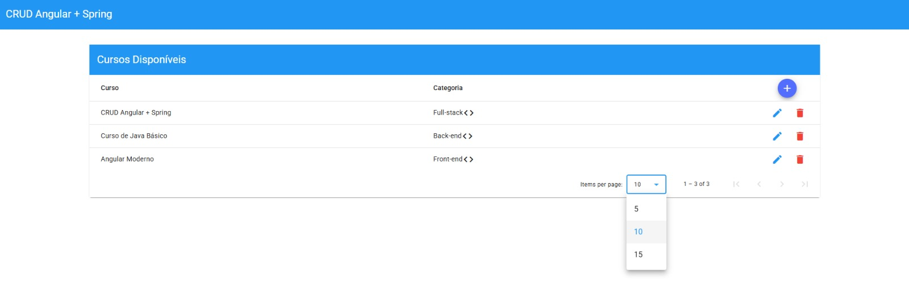
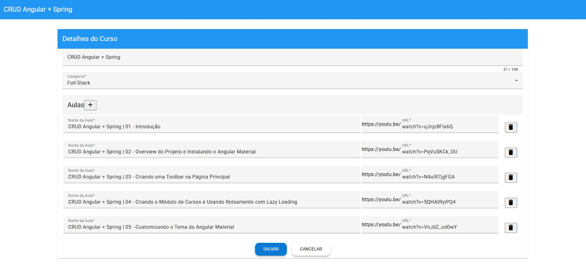

# API REST com Spring Boot e Angular

Aplicação CRUD Angular + Spring com diversas fucionalidades e relacionamento Has-Many.

## 💻 Tecnologias
- Java 21

- Spring Boot 3 (Spring 6)

- Maven

- JPA + Hibernate

- MySQL

- Angular v18

- Angular Material

## ⌨️ Editor / IDE
- Visual Studio Code

- [Java Extensions](https://marketplace.visualstudio.com/items?itemName=loiane.java-spring-extension-pack)

- [Angular Extensions](https://marketplace.visualstudio.com/items?itemName=loiane.angular-extension-pack)

## Funcionalidades disponíveis na API
- ✅ Classe de modelo Java com validação

- ✅ Repositório JPA

- ✅ Paginação JPA

- ✅ Banco de dados MySQL (você pode usar qualquer banco de dados de sua preferência)

- ✅ Controller, Service, and Repository layers

- ✅ Relacionamentos Has-Many (Course-Lessons)

- ✅ Java 17 Records as DTO (Data Transfer Object)

- ✅ Hibernate / Jakarta Validation

## Funcionalidades disponíveis no Front-end
- ✅ Angular Standalone components (Angular v16+)

- ✅ Angular Material components

- ✅ Lista de todos os cursos com paginação

- ✅ Formulário para atualizar/criar cursos com aulas (has-many - FormArray)

- ✅ Tela somente visualização

- ✅ TypedForms

- ✅ Presentational x Smart Components

## Capturas de tela
Página principal com paginação



Formulario com One to Many (Course-Lessons)




## 🔧 Como Rodar o Projeto
### Executando o Back-end
Você precisa ter o Java e o Maven instalados e configurados localmente.

Abra o crud-spring projeto no seu IDE favorito como um projeto Maven e execute-o como um aplicativo Spring Boot.

### Executando o Front-end
1. Clone o repositório.

2. Vá para a pasta do front-end:
``` bash
cd crud-angular
```

3. Instale as dependências:
``` bash
npm install
```

4. Inicie a aplicação Angular:
``` bash
npm run start
```
Este comando executará o projeto Angular com um proxy para o servidor Java, sem exigir CORS.

Abra seu navegador e acesse http://localhost:4200 (porta padrão do Angular).

## 📌 Observações

- Este projeto está com a url do banco de dados MySQL no arquivo do back src/main/resources/application.properties;

- Crie uma base de dados chamada (courses), para que ao rodar a versão do back, as tabelas sejam criadas dentro do schema;

- Projeto ideal para fins didáticos, portfólios ou bases para sistemas maiores;

## Licença
Curso do projeto disponibilizado e ensinado no canal de youtube da professora Loiane Groner.

- [Youtube - Loiane Groner](https://www.youtube.com/@loianegroner)
